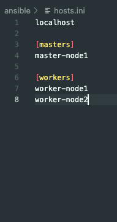

# Simple playbook to spin up microk8s on any plattform !


## Instructions

This Ansible-Playbook creates a [microk8s](https://microk8s.io/)-Cluster with custom amount of nodes. 

You can run this playbook anywhere you want: locally, On-Premise or on Cloud-Instances.

### Prerequisites:

  - Ansible installed on your local machine
  - SSH-access on your machines
  - [snapd](https://snapcraft.io/) installed on your hosts and running
  - user for previlige escalation on your hosts
  
For the underlying O of the nodes, I recommend Ubuntu or Debian- based operating systems. 

###  Fill in your inventory file

Your Kubernetes-Nodes/Hosts should be grouped into masters and workers.

Localhost should also be in your hosts file

Example:



### Run the Playbook

```
 ansible-playbook -i ansible/[YOUR-HOSTS-FILE] ansible/reset.yaml  --private-key=[YOUR-SSH-KEY] --user=[USERNAME]
```

With previlige escalation (depending how you're coennecting to your hosts):

```
ansible-playbook -i ansible/[YOUR-HOSTS-FILE] ansible/reset.yaml  --private-key=[YOUR-SSH-KEY] --become --user=[USERNAME] --ask-pass
```

or

```
ansible-playbook -i ansible/example-hosts.ini ansible/reset.yaml  --private-key=[YOUR-SSH-KEY] --become --user=[USERNAME]  --ask-become-pass
```

The kubeconfig-file will be written directly under you `./kube` directory.


#### Single-Node

If you simply want to deploy a single-node cluster

```
ansible-playbook  --inventory [Hostname/IP-Address],  ansible/site.yaml --ask-become-pass
``` 

Locally:

```
ansible-playbook  --connection=local --inventory 127.0.0.1,  ansible/site.yaml --ask-become-pass       
``` 

### NOTE !

Please don't use this repository for large enterprise- or production environments !

Feel free to contribute to this project for further improvements !
